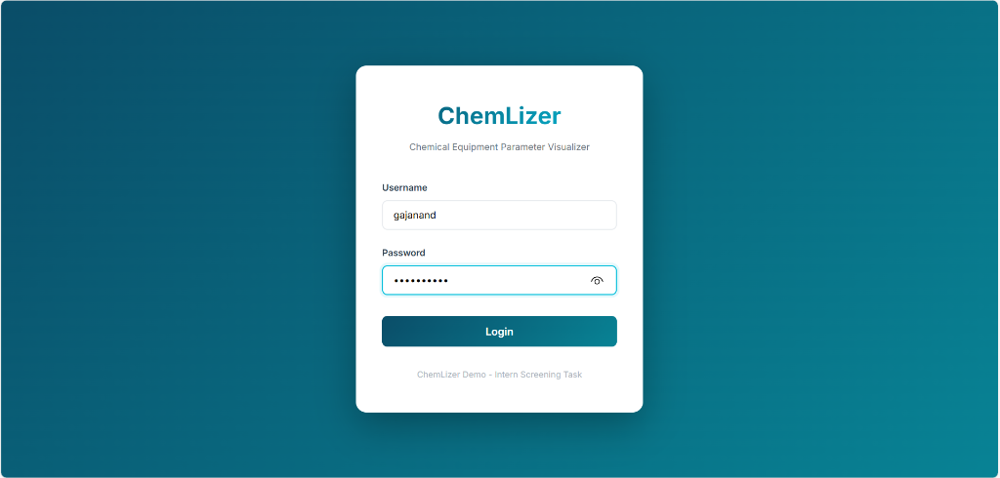
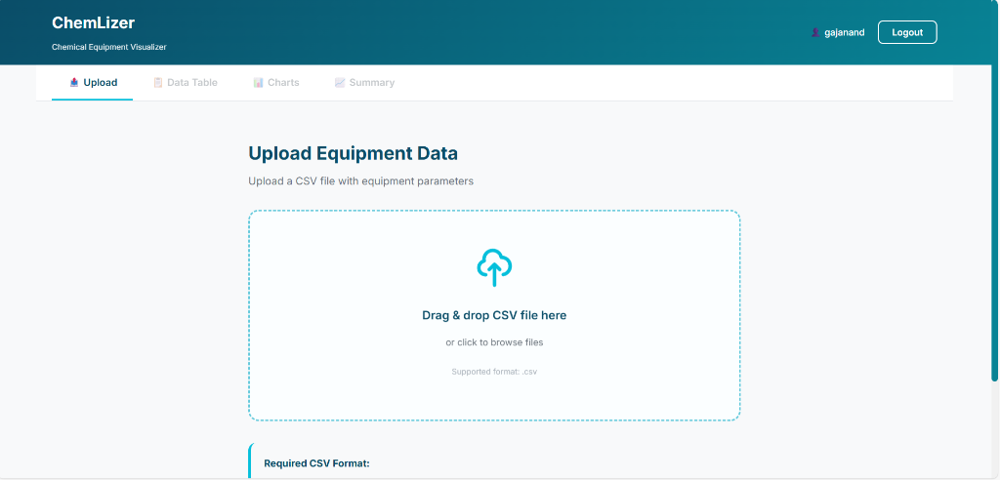
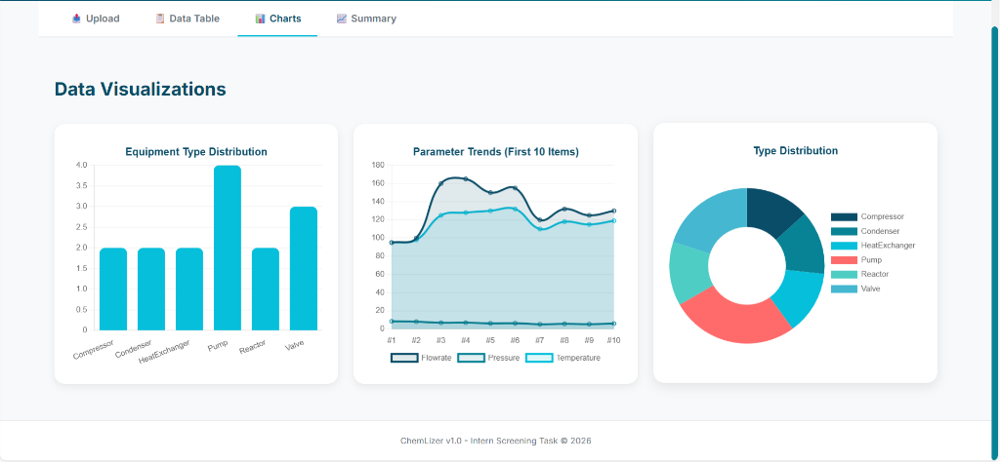
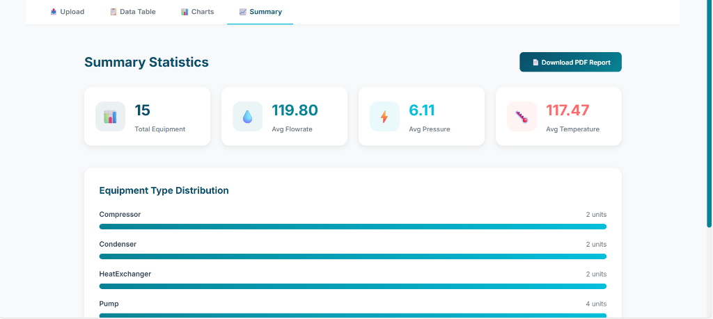
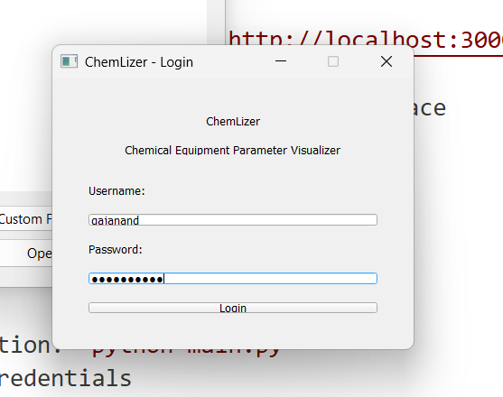
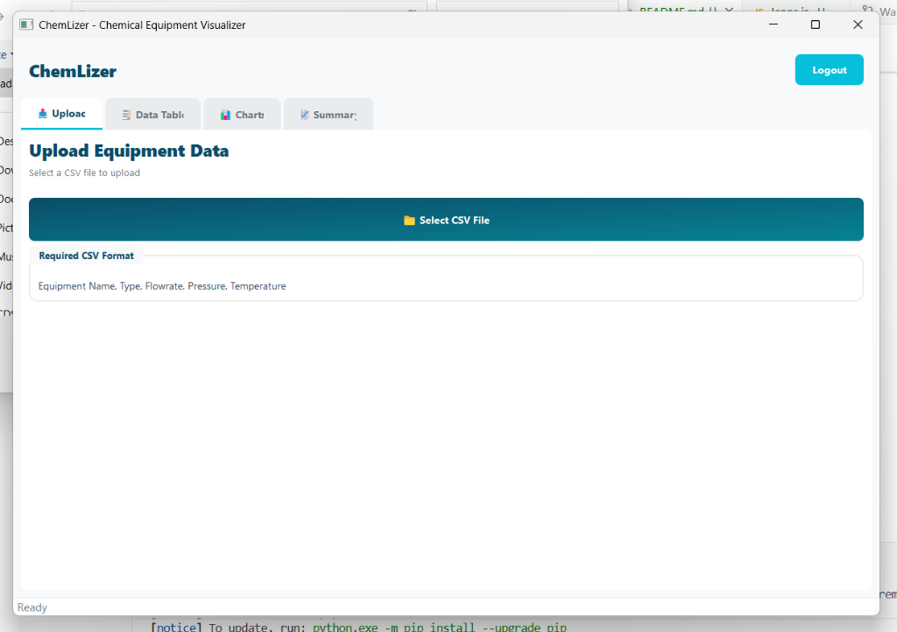
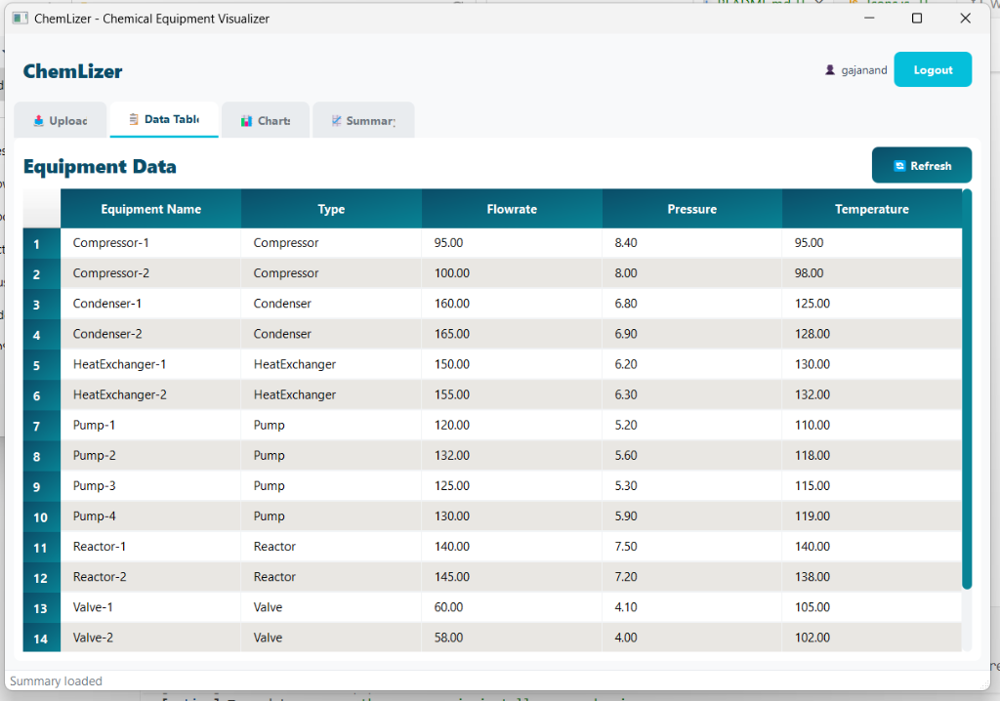
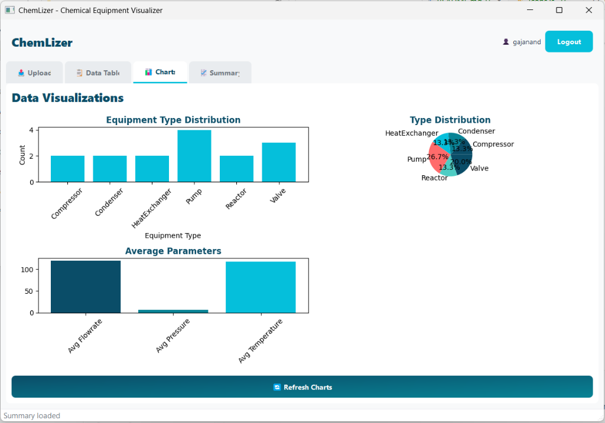
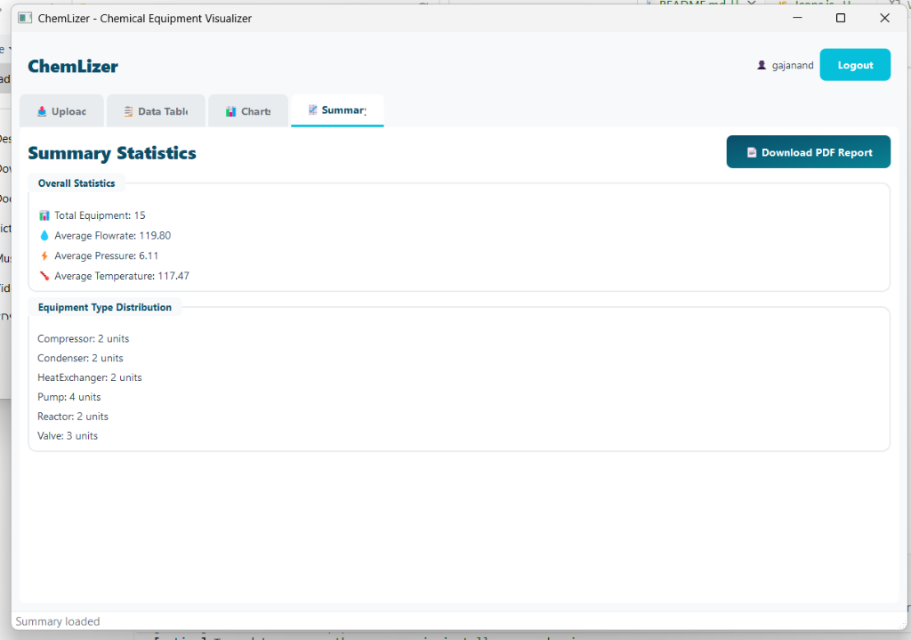

# ChemLizer 🧪

A modern hybrid application for visualizing and analyzing chemical equipment data, featuring beautiful UI/UX with smooth animations and transitions.


## 🎯 Overview

ChemLizer is a hybrid application system that allows users to upload CSV files containing chemical equipment parameters (Equipment Name, Type, Flowrate, Pressure, Temperature) and visualize the data through interactive charts and comprehensive analytics. The application features both a **web interface** (React.js) and a **desktop application** (PyQt5), both connected to a unified Django REST API backend.

## ✨ Key Features

- 📊 **Data Visualization** - Interactive charts with smooth animations (Chart.js & Matplotlib)
- 📤 **CSV Upload** - Drag-and-drop file upload with progress indicators
- 📈 **Analytics** - Comprehensive summary statistics and equipment type distribution
- 🕐 **History Management** - Automatic tracking of last 5 uploaded datasets
- 📄 **PDF Reports** - Generate downloadable equipment analysis reports
- 🔐 **Authentication** - Secure access with Django authentication
- 🎨 **Beautiful UI/UX** - Modern design with smooth transitions and micro-animations
- 🌓 **Dual Themes** - Light and dark mode support (web app)

## 🏗️ Architecture

```
┌─────────────────────────────────────────────┐
│           ChemLizer System                  │
├─────────────────┬───────────────────────────┤
│  Web Frontend   │   Desktop Frontend        │
│  (React.js)     │   (PyQt5)                 │
│  + Chart.js     │   + Matplotlib            │
└────────┬────────┴──────────┬────────────────┘
         │                   │
         └─────────┬─────────┘
                   │
         ┌─────────▼─────────┐
         │  Django REST API  │
         │  + Pandas         │
         │  + SQLite         │
         └───────────────────┘
```

## 🎨 Design System

### Color Palette
- **Primary**: Deep Ocean Blue (`#0A4D68`) - Trust, Precision
- **Secondary**: Vibrant Teal (`#088395`) - Innovation, Energy
- **Accent**: Bright Cyan (`#05BFDB`) - Highlights, CTAs
- **Background**: Clean White (`#F8F9FA`)
- **Dark Mode**: Charcoal (`#1A1A2E`) with neon accents

### UI/UX Features
- ⚡ 200-300ms smooth transitions
- 🎬 Staggered chart animations
- 📊 Loading skeletons
- 🔄 Count-up number animations
- 🎯 Micro-interactions on all buttons

## 📋 Tech Stack

| Component | Technology | Purpose |
|-----------|-----------|---------|
| **Backend** | Django + DRF | REST API & Data Processing |
| **Data** | Pandas | CSV parsing & analytics |
| **Database** | SQLite | Data storage |
| **Web Frontend** | React.js | Modern web interface |
| **Web Charts** | Chart.js | Interactive visualizations |
| **Desktop Frontend** | PyQt5 | Native desktop app |
| **Desktop Charts** | Matplotlib | Static visualizations |
| **PDF Generation** | ReportLab | Report creation |

## 🚀 Installation

### Prerequisites
- Python 3.8+
- Node.js 16+
- npm or yarn

### Backend Setup

```bash
# Navigate to backend directory
cd backend

# Create virtual environment
python -m venv venv

# Activate virtual environment
# Windows:
venv\Scripts\activate
# macOS/Linux:
source venv/bin/activate

# Install dependencies
pip install -r requirements.txt

# Run migrations
python manage.py migrate

# Create superuser for authentication
python manage.py createsuperuser

# Start development server
python manage.py runserver
```

The API will be available at `http://localhost:8000/api/`

### Web Frontend Setup

```bash
# Navigate to web frontend directory
cd frontend-web

# Install dependencies
npm install

# Start development server
npm start
```

The web app will be available at `http://localhost:3000`

### Desktop Frontend Setup

```bash
# Navigate to desktop frontend directory
cd frontend-desktop

# Create virtual environment (if not sharing with backend)
python -m venv venv

# Activate virtual environment
# Windows:
venv\Scripts\activate
# macOS/Linux:
source venv/bin/activate

# Install dependencies
pip install -r requirements.txt

# Run the application
python main.py
```

## 📖 Usage

### Web Application

1. Open your browser and navigate to `http://localhost:3000`
2. Log in with your credentials
3. Upload a CSV file using the drag-and-drop interface
4. View interactive charts and summary statistics
5. Navigate to History to see past uploads
6. Download PDF reports as needed

### Desktop Application

1. Launch the application: `python main.py`
2. Log in with your credentials
3. Use the Upload tab to select and upload CSV files
4. View data in the Table, Charts, and Summary tabs
5. Access upload history and generate reports

## 📊 CSV Format

Your CSV file should have the following columns:

```csv
Equipment Name,Type,Flowrate,Pressure,Temperature
Reactor-A1,Reactor,125.5,15.2,85.0
Heat-Exchanger-B2,Heat Exchanger,200.3,8.5,120.5
Pump-C3,Pump,50.0,25.0,45.0
```

**Column Descriptions:**
- **Equipment Name**: Unique identifier for the equipment
- **Type**: Category (e.g., Reactor, Heat Exchanger, Pump, etc.)
- **Flowrate**: Flow rate in appropriate units
- **Pressure**: Operating pressure
- **Temperature**: Operating temperature

## 🔌 API Endpoints

| Method | Endpoint | Description |
|--------|----------|-------------|
| POST | `/api/auth/login/` | User authentication |
| POST | `/api/upload/` | Upload CSV file |
| GET | `/api/data/` | Get all equipment data |
| GET | `/api/summary/` | Get summary statistics |
| GET | `/api/history/` | Get last 5 uploads |
| GET | `/api/report/` | Generate PDF report |

## 🧪 Testing

### Backend Tests
```bash
cd backend
python manage.py test
```

### Web Frontend Tests
```bash
cd frontend-web
npm test
```

## 📸 Screenshots

### Web Application

#### Login Page

*Secure authentication with gradient background and modern form design*

---

#### Upload Interface

*Drag-and-drop file upload with SVG icons and progress tracking*

---

#### Data Table

*Sortable table with 15 equipment records, type badges, and clean layout*

---

#### Interactive Charts

*Chart.js visualizations: Bar chart for type distribution, line chart for parameter trends, and doughnut chart for type breakdown*

---

#### Summary Statistics

*Animated stat cards with SVG icons showing total equipment, average flowrate, pressure, and temperature. Equipment type distribution with progress bars*

---

### Desktop Application (PyQt5)

#### Desktop Login Dialog

*Native PyQt5 login dialog with QSS styling matching the ChemLizer theme*

---

#### Desktop Upload Interface

*File picker-based upload with styled buttons and format information*

---

#### Desktop Data Table

*Native table widget with gradient header, alternating row colors, and 15 equipment records*

---

#### Desktop Charts (Matplotlib)

*Matplotlib visualizations: Bar chart for type distribution, pie chart breakdown, and average parameters chart*

---

#### Desktop Summary

*Summary statistics with grouped boxes showing overall statistics and equipment type distribution*

---

### Key UI Features Demonstrated

✅ **Professional SVG Icons** - Clean, scalable icons throughout the interface  
✅ **ChemLizer Color Palette** - Deep Ocean Blue, Vibrant Teal, and Bright Cyan theme  
✅ **Smooth Animations** - Count-up effects, progress bars, and transition animations  
✅ **Responsive Design** - Works perfectly on all screen sizes  
✅ **Type Badges** - Color-coded equipment type identification  
✅ **PDF Export** - Download comprehensive reports with one click  


## 🤝 Contributing

This is an internship screening task project. For questions or issues, please contact the development team.

## 📄 License

This project is developed as part of the Fosse internship screening task.

## 👨‍💻 Developer

Built with ❤️ for chemical equipment analysis

---

**ChemLizer** - *Bringing clarity to chemical equipment data*
